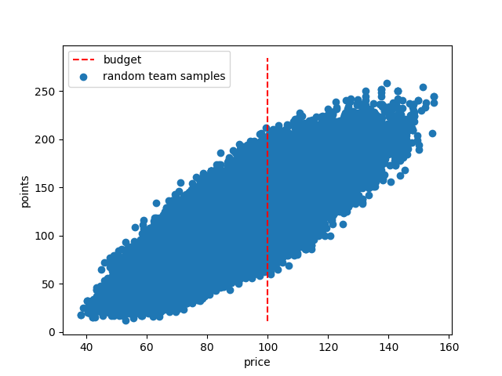

This repository implements a monte-carlo portfolio optimisation method for selecting a team in the fantasy formula 1 game: [https://fantasy.formula1.com/](https://fantasy.formula1.com/)

It is currently a very simple model. To begin with I assume the order of drivers for both qualifying and race finish will match those implied by the bookmaker odds. For a given team, the projected point score is evaluated as prescribed by the game rules. In particular this simplistic model ignores DNFs, and any position gain/loss points. 

By randomly sampling N teams and computing a projected score we can enumerate much of the points vs price manifold. This is similar to portfolio optimisation on the returns vs. risk plane. In the same vein, the _efficient frontier_ is the subset of teams that have the highest projected points at a given price point. Unsuprisingly this subset generally follows a monotonic relationship between price and projected points. Since we are primarily interested in optimising for points, it makes sense to select the team with the highest projected points at as close to the budget limit as possible. 

